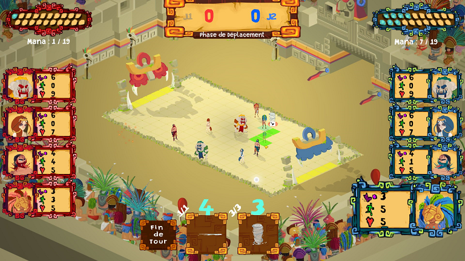

# Orbeon <a href="https://archer01.itch.io/orbeon">(Download game)</a>&nbsp;<a href="https://archer01-tactic-turn-based-unity.hashnode.dev/">(Dev Blog)</a>

 
  &nbsp
  &nbsp
  &nbsp
  &nbsp
  

---

## Résumé
Jeu tactique en tour par tour sur le thème du football aztèque, Orbeon est un jeu de joueur contre joueur dans lequel il faut envoyer la balle dans le but adverse grâce aux pouvoirs de votre équipe (tornade, murs...) pour la rediriger.

C'est mon projet de fin d'année d'étude de Manager de jeu vidéo, dans lequel j'étais chef de projet et à la fois développeur en codant la plupart du jeu.

Ce git est là pour montrer la partie script du projet, tout le reste est enlevé pour des raisons de tailles acceptable sur Github, le projet unity complet est disponible ici :
https://drive.google.com/file/d/1ANxhCk37DhUt_x30QQrz_DT7BBJMYeGi/view?usp=sharing

---

## Features
  * Jeu tactique tour par tour de 4v4 autour du déplacement de la balle
  * Ambiance aztèque et graphismes crées spécialement par notre équipe pour l'occasion
  * Petit tuto intégré au jeu

---

## Crédit
* Julien Guénard : Développeur Unity
* Arthur Llorens : Développeur Unity
* Rindra Rakotomanga : Artiste 2D
* Jean-Maxime Pichon : Game Designer

---

## Liens
  * <a href="https://www.youtube.com/channel/UCwxuydeEi6WyM-X6nsPs-8A">Youtube</a>
  * <a href="https://archer01.itch.io/">Itch.io</a>
  * <a href="https://hashnode.com/@Archer01">Hashnode (Dev Blog)</a>
  * <a href="https://www.linkedin.com/in/julienguenard/">Linkedin</a>
  * <a href="https://twitter.com/julien_guenard">Twitter</a>
